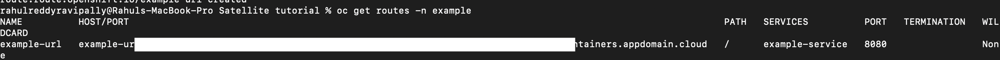
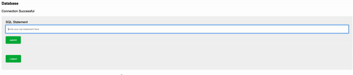

# Satellite Link Example

This simple application allows to query a PostgreSQL database. The form prompts you for the database credentials. These credentials will be sent to the application running in the cluster and the connection will be made to the database over Satellite link.

This sample requires:
- a running Satellite location,
- an OpenShift cluster running in the location with its image registry correctly configured,
- a _Databases for PostgreSQL_ instance running in IBM Cloud.

## Deploy the application on Red Hat OpenShift cluster

### Connect to the OpenShift cluster in your CLI

1. To log in, you need a token which can be generated after you log in to OpenShift Cluster web console. Click the drop-down under your name in the right corner of your screen and select Copy Login Command.
   
1. A new window will open requesting the login token details. Copy the login token. Copy the login token
   
1. In your terminal, paste the login token. Run the command.
1. You are now connected to your OpenShift cluster.

### Create the application

1. Create a new project:
   ```sh
   oc new-project <project_name>
   ```
1. Create a new application in the OpenShift project:
   ```sh
   oc new-app python~https://github.com/IBM/satellite-link-example.git --name link-example
   ```
1. Wait for the first application build to complete by monitoring the logs:
   ```sh
   oc logs -f bc/link-example
   ```
1. When the build is complete, create a secure route to access the application:
   ```sh
   oc create route edge link-example-https --service=link-example --port=8080
   ```
1. Retrieve the created route:
   ```sh
   oc get route link-example-https
   ```
   

## Test the application

### Fill in the details as shown below.

In place of hostname and port, give your Satellite endpoint url and its port. All other details will be found in the credential section of the service.


### Run the following sql commands 

1. Create a table
   ```sql
   CREATE TABLE EMPLOYEE(FIRST_NAME CHAR(20) NOT NULL,    LAST_NAME CHAR(20),    AGE INT,    SEX CHAR(1),    INCOME FLOAT )
   ```
1. Insert a row
   ```sql
   INSERT INTO EMPLOYEE(FIRST_NAME, LAST_NAME, AGE, SEX, INCOME) VALUES ('John', 'Win', 30, 'M', 9000)
   ```
1. List all rows
   ```sql
   SELECT * FROM EMPLOYEE
   ```
1. Delete the table
   ```sql
   DROP TABLE EMPLOYEE
   ```



## See the data rate in the Satellite dashboard


## Remove the application

Delete the project:
```sh
oc delete project <project_name>
```
