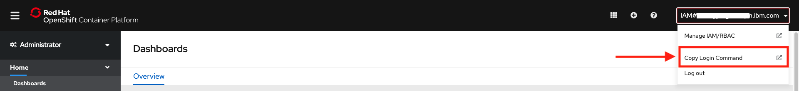
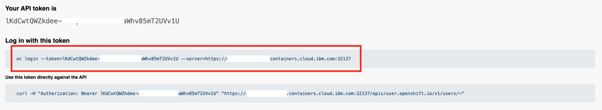
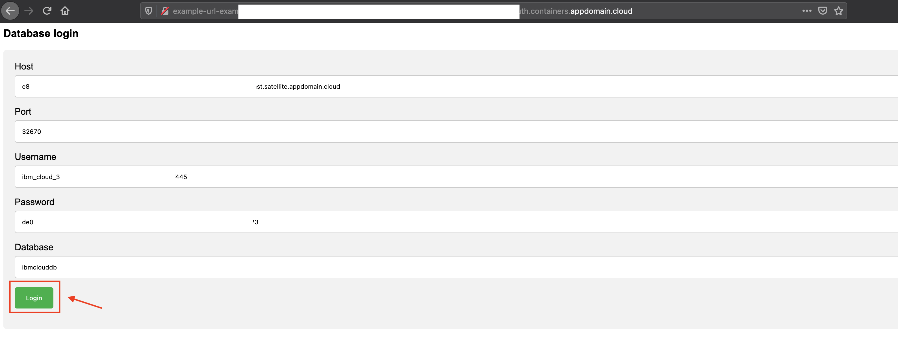
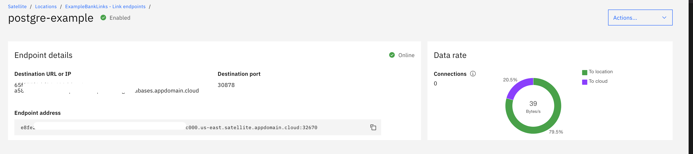

# satellite-link-example

### 1. Deploy the application on Red Hat OpenShift cluster

#### 1.1. Connect to the OpenShift cluster in your CLI

- To log in, you need a token which can be generated after you log in to OpenShift Cluster web console. Click the drop-down under your name in the right corner of your screen and select Copy Login Command.

- A new window will open requesting the login token details. Copy the login token. Copy the login token

- In your terminal, paste the login token. Run the command.

- You are now connected to your OpenShift cluster.

#### 1.2. Create a new project as follows,

    oc new-project <project_name>

#### 1.3. Download the `ExampleApp/deployment.yaml` in this repo, and run the following command

    oc  apply -f  deployment.yaml

#### 1.4. Run the following command and copy the route url 

    oc get routes -n <project_name>
    

### 2. Run the application

#### 2.1 Fill in the details as shown below.

In place of host url and port, give your satellite endpoint url and its port. All other details will be found in the credential section of the service.

#### 2.2 Run the following sql commands 

Lets try out some SQL commnads and see if it works.

List of sql commands that I used:
`CREATE TABLE EMPLOYEE(
   FIRST_NAME CHAR(20) NOT NULL,
   LAST_NAME CHAR(20),
   AGE INT,
   SEX CHAR(1),
   INCOME FLOAT`
`INSERT INTO EMPLOYEE(FIRST_NAME, LAST_NAME, AGE, SEX,
   INCOME) VALUES ('Amol', 'Dhondse', 30, 'M', 9000)`
`SELECT * FROM EMPLOYEE`
`DROP TABLE EMPLOYEE`

#### 2.3 See the data inflow on satellite dashboad.

